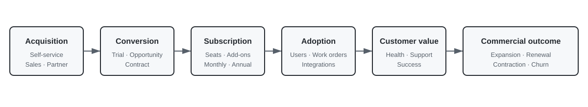
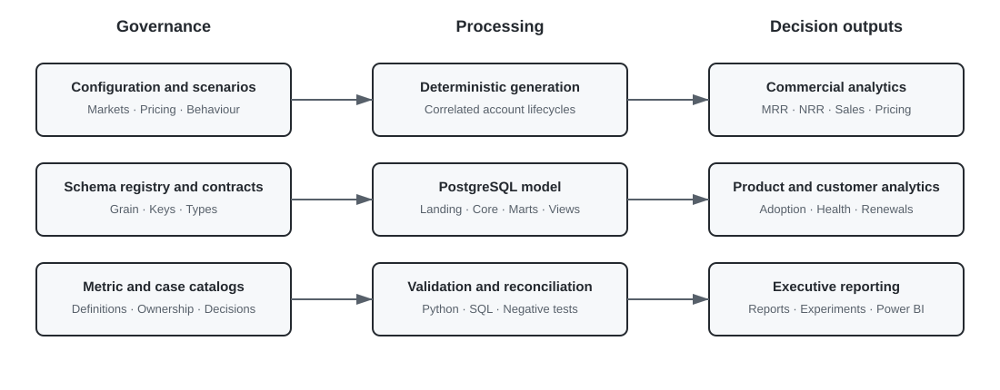
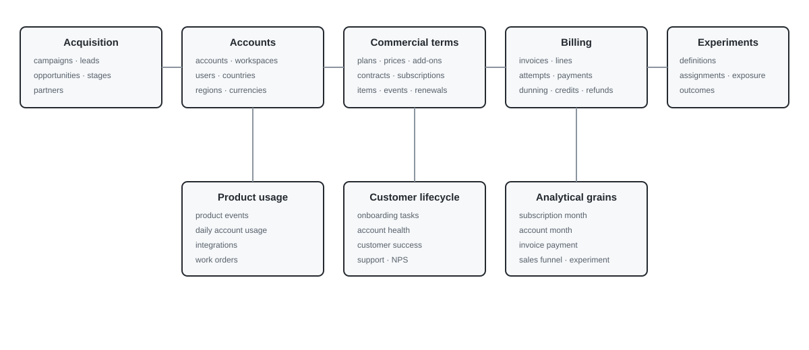
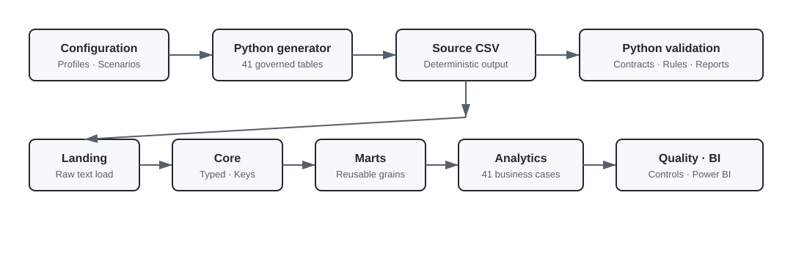

# Synthetic B2B SaaS Platform Analytics

End-to-end analytics platform for a multi-country European field-service-management SaaS business.

The repository combines configurable source-data generation, PostgreSQL modelling, governed metrics, commercial and product analytics, experiment evaluation, data-quality validation, executive reporting and a Power BI implementation pack in one integrated codebase.

The synthetic company is headquartered in Germany and serves customers across DACH, Benelux, the Nordics, Western Europe, Southern Europe and Central Europe. Customers are acquired through self-service, sales-assisted and partner-led motions and subscribe through monthly, annual or multi-year contracts with seat-based pricing and recurring add-ons.

All companies, people, contracts, invoices, payments and product events are synthetic. The project reproduces realistic analytical structures and operating scenarios without exposing confidential or proprietary information.



## Business model

The product supports companies that manage mobile field teams, service locations and work orders. The core customer lifecycle is:

```text
Account registration
        ↓
Trial or sales opportunity
        ↓
Contract and paid subscription
        ↓
Workspace and user onboarding
        ↓
First work order created
        ↓
First work order completed
        ↓
Broader feature and integration adoption
        ↓
Expansion, renewal, contraction or churn
```

The commercial model includes:

- Starter, Professional, Business and Enterprise plans;
- monthly, annual and multi-year contracts;
- base fees, paid seats and recurring add-ons;
- negotiated discounts and regional currencies;
- upgrades, seat expansion, contraction and add-on adoption;
- payment failures, retries, dunning, credit notes and refunds;
- voluntary and involuntary churn;
- renewal pipelines and customer-success interventions.

## Architecture

The same generated source files support two complementary workflows:

- Python validation, analysis, experiment evaluation and report generation;
- PostgreSQL landing, typed core, reusable marts, business-facing analytics and SQL quality controls.

One schema registry governs source generation, YAML contracts, Python validation and PostgreSQL logical types. This prevents separate definitions from drifting across layers.



## Business domains

| Domain | Typical decisions |
|---|---|
| Recurring revenue | MRR bridge, ARR growth, GRR, NRR, expansion and churn priorities |
| Sales and acquisition | channel allocation, pipeline quality, partner performance and sales-cycle management |
| Pricing and packaging | annual-plan adoption, discounts, paid-seat economics and add-on attachment |
| Product adoption | activation, time to value, seat utilisation, workflow, automation and integration adoption |
| Customer success | account health, renewal risk, intervention coverage and renewal planning |
| Support operations | service levels, escalations, ticket drivers and operating capacity |
| Billing and collections | payment success, retry recovery, dunning and overdue receivables |
| Experimentation | assignment integrity, exposure, primary effects, guardrails and launch decisions |
| Executive reporting | regional performance, recurring-revenue movement and operating risk |

The machine-readable analytical catalog maps every business question to its SQL view and supported decision:

```text
analytics/business_case_catalog.yaml
```

## Data model

The source model contains 41 normalised tables across:

- reference data, geography, currencies and FX rates;
- accounts, partners, campaigns, leads and opportunities;
- workspaces and users;
- plans, prices, contracts, subscriptions, effective-dated items and events;
- renewals, invoices, payment attempts, payments, dunning, credits and refunds;
- product events, daily account usage, integrations and work orders;
- onboarding, account health, customer-success interactions, support and NPS;
- experiment definitions, assignments, exposures and outcomes.

Detailed grains, keys, relationships and logical types are maintained in `contracts/` and `docs/03_DATA_MODEL.md`.



## Repository layout

```text
synthetic-b2b-saas-platform-analytics/
├── config/
│   ├── config.yaml            base business configuration
│   ├── profiles/              smoke, portfolio and scale profiles
│   └── scenarios/             alternative operating conditions
├── data_generator/            Python package and command-line interface
├── contracts/                 governed source-table contracts
├── metrics/                   governed metric definitions
├── sql/
│   ├── 00_database/           database ownership boundary
│   ├── 00_admin/              pipeline audit and source counts
│   ├── 01_landing/            contract-driven raw loading
│   ├── 02_core/               enriched entities, constraints and indexes
│   ├── 03_marts/              reusable subscription, customer and billing grains
│   ├── 04_analytics/          business-facing analytical views
│   └── 05_quality/            SQL controls and reconciliations
├── analytics/                 domain documentation and business-case catalog
├── experiments/               experiment specifications and evaluation entry point
├── reports/                   generated and representative report packs
├── dashboards/power_bi/       semantic model, DAX, theme and page specifications
├── notebooks/                 executive, revenue and experiment reviews
├── docs/                      architecture, methods, runbooks and evidence
├── scripts/                   Python setup, execution and maintenance entry points
├── tests/                     automated, negative and reproducibility tests
└── repository_manifest.json   file inventory with SHA-256 hashes
```

## Analytical capabilities

The implemented analyses answer questions such as:

- How did opening MRR move to closing MRR through new business, expansion, contraction, churn and reactivation?
- Which countries, customer segments, plans and sales motions produce durable recurring revenue?
- Are GRR and NRR sufficient to protect the installed revenue base?
- Which customer groups pay for unused seats or fail to adopt the core workflow?
- How long does an account take to complete its first real work order?
- Which usage, support and payment signals identify renewal risk?
- Which failed payments recover through retries and dunning?
- Which channels and partners produce customers rather than only leads?
- Which product and commercial experiments should launch, stop or continue collecting data?

## Governed metrics

Forty governed definitions are maintained in:

```text
metrics/metric_definitions.yaml
```

Important conventions:

- MRR is reconstructed from effective-dated recurring subscription items;
- ARR is MRR multiplied by twelve and is not invoice revenue;
- annual prepayments remain represented at monthly recurring value;
- tax, refunds, credits and one-off charges are excluded from MRR;
- cross-market reporting uses governed monthly FX rates and EUR as reporting currency;
- churn and contraction are separated at account-month grain;
- active product use is measured independently from paid-seat entitlement.

## Experiments

Four account-level experiments are connected to explicit assignments, exposures and outcomes:

| Experiment | Primary outcome | Main guardrail |
|---|---|---|
| Guided onboarding checklist | 30-day activation | onboarding support demand |
| Annual-plan discount framing | annual-plan selection | discounted ARPA |
| Automation adoption prompt | automation adoption | seven-day retention |
| Customer-success renewal intervention | renewal | contraction and discount cost |

Each experiment folder contains the hypothesis, randomisation unit, primary metric, guardrails, prespecified segments and decision rule. The report pack evaluates assignment balance, exposure, effects, uncertainty and the final business decision.

## Data quality

Quality is checked before and after database loading.

Python validation covers:

- required tables and columns;
- logical data types;
- primary-key completeness and uniqueness;
- foreign-key integrity;
- contract, subscription and user chronology;
- effective-dated item intervals;
- invoice arithmetic and invoice-line reconciliation;
- payment-attempt and captured-payment consistency;
- product, work-order and support lifecycle rules;
- score ranges and experiment relationships.

The PostgreSQL layer applies primary keys, foreign keys and relationship indexes, then executes 50 explicit post-load controls and record-level reconciliation views for recurring revenue, invoices, payments and effective periods.

## Execution pipeline

Project entry points are Python files. Business transformations remain in Python and SQL. No container runtime is required.

### Environment

Run from the repository root on Windows:

```console
py -3.14 scripts/setup_environment.py
```

The script creates `.venv` and installs the package with development dependencies.

### Tests

```console
py scripts/run_tests.py
```

### Generate and analyse the representative dataset

```console
py scripts/run_sample.py
```

Equivalent direct command:

```console
.venv\Scripts\python.exe -m b2b_saas_platform_analytics.cli run-all ^
  --config config/profiles/smoke.yaml ^
  --scenario config/scenarios/baseline.yaml ^
  --data-output data/generated/sample ^
  --report-output reports/generated/sample
```

### Generate the portfolio dataset

```console
py scripts/run_default.py
```

### Configure PostgreSQL

```console
copy .env.example .env
notepad .env
```

Set the local PostgreSQL password in `.env`. `PGMAINTENANCEDB=postgres` is used only to verify or create the target database.

### Build the database

```console
py scripts/build_postgresql.py
```

The loader automatically uses the generated default dataset when available and otherwise uses the generated sample dataset. If `PGDATABASE` does not exist, it is created through `PGMAINTENANCEDB`; the configured role needs `CREATEDB` permission only for that first operation. The loader then creates the project schemas, loads CSV files with PostgreSQL `COPY`, builds typed core tables, applies keys and indexes, builds marts and analytical views, executes SQL controls and records the pipeline result.

The project uses local Python, PostgreSQL and optional Power BI Desktop. It contains no Dockerfile, Compose configuration or container dependency.

The complete local runbook is in `LOCAL_RUN.md`.



## Verified Python run

The committed smoke profile was regenerated and analysed with fixed seed `20260803`.

| Entity | Rows |
|---|---:|
| Accounts | 250 |
| Users | 1,271 |
| Contracts | 83 |
| Subscriptions | 83 |
| Subscription items | 208 |
| Invoices | 573 |
| Payment attempts | 628 |
| Captured payments | 562 |
| Product events | 13,110 |
| Daily account usage | 4,640 |
| Support tickets | 229 |
| Experiment assignments | 287 |
| **All source tables** | **56,791** |

The run produced:

- 41 source tables;
- 531 Python validation checks with zero failures;
- 13 analytical reports;
- a reconciled MRR bridge;
- four experiment decisions;
- four latest-month renewal-risk accounts;
- 253 passing automated tests.

The PostgreSQL build is intentionally verified separately on the local PostgreSQL installation. The loader and SQL assets are included, but this archive does not claim a database run that was not executed in the current environment.

Detailed evidence is in `docs/12_VERIFICATION_EVIDENCE.md`.

## Technical summary

| Area | Implemented evidence |
|---|---|
| Source model | 41 normalised source tables and matching YAML contracts |
| PostgreSQL | landing, typed core, marts, analytics, quality and metadata schemas |
| Relationships | primary keys, foreign keys and relationship indexes applied during build |
| Analytics | 41 catalogued business cases and matching SQL views |
| Metrics | 40 governed metric definitions |
| Quality | 531 Python checks in the verified sample and 50 SQL controls |
| Testing | 253 automated tests including negative, reproducibility, repository-governance and local-artifact isolation cases |
| Reporting | 13 generated analytical reports and executive narrative |
| Experiments | four exposure-linked account-level experiments |
| BI | semantic model, governed DAX, theme, validation and eight page specifications |

## Power BI

The repository includes a build-ready Power BI implementation pack rather than a binary `.pbix` file:

- PostgreSQL source views and refresh order;
- star-schema relationships;
- governed DAX measures;
- eight dashboard-page specifications;
- JSON theme;
- validation against Python and PostgreSQL outputs.

See `dashboards/power_bi/README.md`.

## Documentation

| Document | Purpose |
|---|---|
| `docs/01_BUSINESS_CONTEXT.md` | SaaS product, markets, pricing and customer lifecycle |
| `docs/02_ARCHITECTURE.md` | data flow and layer responsibilities |
| `docs/03_DATA_MODEL.md` | source entities, grains and relationships |
| `docs/04_METRICS.md` | revenue, product, commercial and operating definitions |
| `docs/05_ANALYTICAL_CASES.md` | business questions and SQL mapping |
| `docs/06_EXPERIMENTS.md` | experiment designs and decision rules |
| `docs/07_DATA_QUALITY.md` | contracts, controls, reconciliation and failure policy |
| `docs/08_REPRODUCIBILITY.md` | seeds, manifests, scenarios and fingerprints |
| `docs/09_POSTGRESQL_RUNBOOK.md` | local setup, build and troubleshooting |
| `docs/10_TEST_STRATEGY.md` | automated, negative and pipeline testing |
| `docs/11_LIMITATIONS.md` | modelling boundaries and interpretation |
| `docs/12_VERIFICATION_EVIDENCE.md` | completed local Python execution results |
| `docs/13_POWER_BI_IMPLEMENTATION.md` | semantic model and dashboard build sequence |

## Scope

Included:

- European B2B SaaS subscription economics;
- CRM, self-service, sales-assisted and partner-led acquisition;
- recurring seat and add-on billing;
- monthly, annual and multi-year contracts;
- multi-currency reporting;
- product adoption and core workflow usage;
- customer success, renewals and support;
- payment retries, dunning, credits and refunds;
- controlled experiments;
- local PostgreSQL analytical modelling;
- Power BI implementation specification.

Not included:

- production orchestration infrastructure;
- predictive-model deployment;
- front-end SaaS application code;
- statutory revenue-recognition accounting;
- real customer or employee data.

## License

Distributed under the MIT License. See `LICENSE`.
