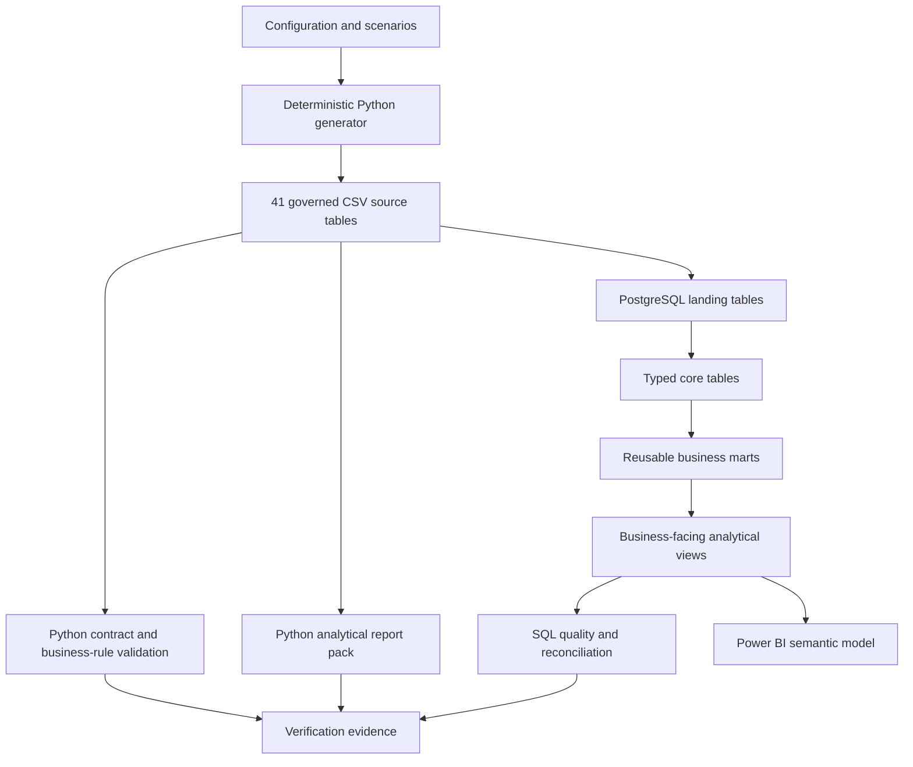

# Architecture

## Flow

## Design principles

- One schema registry controls contracts, CSV validation and PostgreSQL types.
- Source tables preserve operational grain; marts create reusable analytical entities.
- MRR is reconstructed from effective-dated subscription items.
- Product use and paid entitlement remain separate.
- Financial totals reconcile from line to header and payment attempt to payment.
- Experiments distinguish assignment, exposure and outcome.
- Scenarios modify business behaviour without changing analytical code.

## Layers

### Configuration

`config/config.yaml` contains the shared business model. `config/profiles/smoke.yaml`, `portfolio.yaml` and `scale.yaml` select execution volumes and date ranges. Scenario files modify conversion, churn, support pressure, adoption or payment recovery.

### Generator

The generator creates correlated customer lifecycles. Conversion, onboarding, product adoption, payment performance, health, expansion and churn are not independent random fields.

### Contracts

Each table has a YAML contract with its grain, primary key, foreign keys, columns, logical types and nullability.

### PostgreSQL

- `landing`: source values loaded as text.
- `core`: contract-driven typed tables.
- `mart`: subscription month, MRR movement, account month, payment and funnel entities.
- `analytics`: governed business views.
- `quality`: controls and reconciliations.
- `metadata`: pipeline runs and source row counts.

### Reporting

The Python report pack supports local execution without PostgreSQL. The Power BI specification uses the PostgreSQL analytical layer when available.
