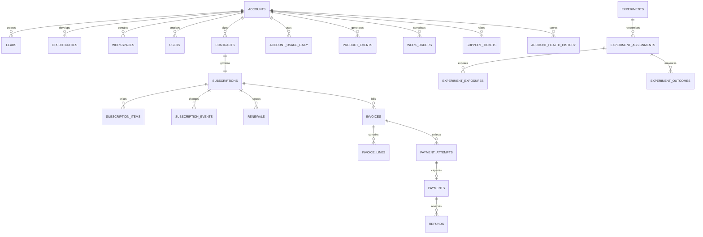

# Data Model

## Main entities

## Subscription modelling

`subscriptions` stores the commercial lifecycle and current status. `subscription_items` stores effective-dated recurring components:

- plan item;
- seat quantity;
- recurring add-on;
- effective start and end;
- local-currency and EUR MRR.

A change in plan or seat quantity closes the previous interval and creates a new interval. This supports historical reconstruction without overwriting prior commercial state.

## Billing modelling

Invoices represent monthly or annual billing. Annual invoices cover a twelve-month service period, while MRR remains monthly recurring value. Invoice lines reconcile to invoice subtotal. Payment attempts preserve retry order, failure reason and provider response. Captured payments reference successful attempts.

## Product modelling

`account_usage_daily` is an analytical source aggregate designed for scalable generation. `product_events` and `work_orders` provide detailed lifecycle examples. Paid seats are stored independently from active users so that utilisation can be measured.

## Complete contract catalog

The authoritative source-table definitions are under `contracts/`. The contract catalog is generated from `b2b_saas_platform_analytics.schema.TABLE_SCHEMAS` to prevent drift between documentation, validation and database loading.
